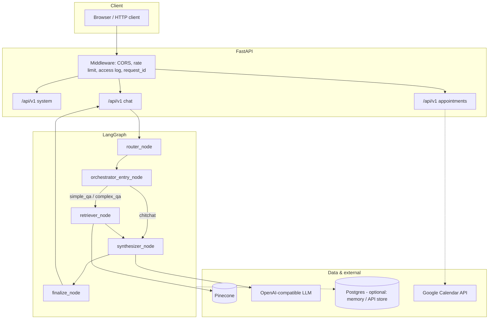

# MedAgent RAG (End-to-End)

A **medical assistant** stack combining **hybrid RAG** (dense retrieval + BM25 over candidate passages), **LLM-based query routing**, **LangGraph** for multi-step flows, and optional **appointment scheduling** with Google Calendar. The HTTP API is built with **FastAPI**.

---

## Table of Contents

- [Demo](#demo)
- [Features](#features)
- [Architecture & System Design](#architecture--system-design)
- [Data Pipeline (Ingestion to Query)](#data-pipeline-ingestion-to-query)
- [Repository Layout](#repository-layout)
- [Requirements](#requirements)
- [Installation](#installation)
- [Configuration (.env)](#configuration-env)
- [Running Locally](#running-locally)
- [Docker](#docker)
- [API Overview](#api-overview)
- [Health & Readiness](#health--readiness)
- [Testing](#testing)
- [Deployment](#deployment)
- [Troubleshooting](#troubleshooting)
- [Roadmap & Current Limitations](#roadmap--current-limitations)
- [Contributing](#contributing)
- [Medical Disclaimer](#medical-disclaimer)

---

## Demo

1. Start the API (locally or with Docker — see below).
2. Open **Swagger UI**: [http://localhost:8000/docs](http://localhost:8000/docs).
3. Static chat HTML: [http://localhost:8000/chat-ui/](http://localhost:8000/chat-ui/).
4. Suggested flow:
   - `POST /api/v1/chat/sessions` — create a session.
   - `POST /api/v1/chat/sessions/{session_id}/messages` — send a medical question or booking intent.

[](https://youtu.be/WNAyGzHLqOE)

---

## Features

| Area | Description |
|------|-------------|
| **Hybrid RAG** | Dense search via **Pinecone** (embeddings **BAAI/bge-m3**) fused with **BM25** over retrieved candidates; optional cross-encoder **reranker** (`USE_RERANKER`, `RERANKER_MODEL_NAME`). |
| **Query routing** | LLM classifies into `simple_qa`, `complex_qa`, `appointment`, `chitchat`, `clarify`, `unsupported` (see `src/agents/router.py`). |
| **Complex QA** | `complex_qa`: planner splits into sub-queries → retrieve each → merge context → synthesize. |
| **Conversation & memory** | LangGraph with **in-memory** or **Postgres** checkpointer (`CHECKPOINTER_BACKEND`, `MEMORY_URL`). |
| **Scheduling** | Multi-turn flow in the graph + REST `/api/v1/appointments`; Google Calendar when env vars and credential file are configured. |
| **HTTP API** | Chat sessions, messages, appointments, feedback (schemas in `src/api/schemas.py`). |
| **Operations** | CORS, rate limiting on `/api/`, access logging, `request_id`, static mount at `/chat-ui`. |

---

## Architecture & System Design



**Summary**

- **FastAPI** is the edge; conversational handling goes through **`run_agent`** → **`build_graph()`** (`src/agents/orchestrator.py`, `src/graph/graph_builder.py`).
- **Retriever** targets a configurable Pinecone index/namespace; hybrid weights via `HYBRID_DENSE_WEIGHT` / `HYBRID_BM25_WEIGHT`.
- **Session/message persistence**: `src/api/store.py` — Postgres when `API_DATABASE_URL` is set, otherwise in-memory.

---

## Data Pipeline (Ingestion to Query)

### 1. Collection (optional, per use case)

- **`src/ingestion/crawler.py`** — reference crawler for article-style content (YouMed-like); extend or replace for other sources.

### 2. Cleaning & chunking

- **`src/ingestion/cleaner.py`** — text normalization for the ingestion pipeline.
- **`src/ingestion/chunking.py`** — **`MarkdownChunker`**: Markdown headers (`##`, `###`) + **RecursiveCharacterTextSplitter**, metadata (`section`, `subsection`), JSONL input for the indexer.

### 3. Embeddings & Pinecone indexing

- **`src/ingestion/embedding.py`** — text embeddings (CLI indexer defaults to **`BAAI/bge-m3`**).
- **`src/ingestion/indexing.py`** — read chunked JSONL → batch embed → create Pinecone serverless index if missing → namespace **upsert**.

CLI (after setting `PINECONE_API_KEY` and preparing JSONL):

```bash
python -m src.ingestion.indexing --input path/to/processed.jsonl --index-name YOUR_INDEX --namespace default
```

Other flags: `--chunk-size`, `--chunk-overlap`, `--batch-size`, `--cloud`, `--region` (see `argparse` in the module).

### 4. Runtime query path

1. User sends a message → API calls **`run_agent`**.
2. **`router_node`** (continues pending appointment flows) → **`route_query`** (LLM).
3. For `simple_qa` / `complex_qa`: **`hybrid_retrieve`** (`src/retrieval/hybrid_search.py`): Pinecone dense → BM25 over candidate text → weighted fusion → optional rerank.
4. **`synthesizer`** generates the answer from context plus safety-oriented prompts.
5. **`finalize_node`** materializes `final_response` for the API.

**Note:** **`src/services/rag_service.py`** and **`agent_service.py`** are stubs (`NotImplementedError`). Production chat flows use the LangGraph pipeline and routes, not those modules yet.

---

## Repository Layout

```
medagent-rag-end2end/
├── deploy/
│   ├── RUNBOOK.md              # Operations: Docker, pytest, smoke tests
│   └── docker/
│       └── frontend.Dockerfile # Next.js — not wired in compose (skeleton frontend)
├── frontend/
│   ├── app/                    # Next.js (package.json deps incomplete)
│   └── static-chat/            # Static UI served via FastAPI /chat-ui/
├── src/
│   ├── agents/                 # Router, planner, synthesizer, LLM helper, appointment tools
│   ├── api/                    # FastAPI app, routes, schemas, store, middleware, env_loader
│   ├── config/               # Shared settings where used
│   ├── graph/                  # LangGraph state, nodes, graph_builder
│   ├── ingestion/              # Crawler, cleaner, chunking, embedding, indexing CLI
│   ├── retrieval/              # Vector store, hybrid search, reranker helpers
│   └── services/               # Stub services for future extraction
├── Dockerfile                  # Production-style API image
├── docker-compose.yml          # api service + env_file .env
├── requirements.txt
├── .env.example                # Env template — never commit secrets
└── README.md
```

---

## Requirements

- **Python 3.11+** (Dockerfile uses `python:3.11-slim`).
- **Credentials & services**: OpenAI-compatible API (`OPENAI_API_KEY`), Pinecone (`PINECONE_*`) for full RAG.
- **Optional**: Postgres (`MEMORY_URL`, `API_DATABASE_URL`), Google Calendar credentials + `GOOGLE_CALENDAR_ID`.
- **Docker**: Docker Desktop (Windows/macOS) or Docker Engine (Linux) for `docker compose`.

**Warning:** `requirements.txt` pulls **PyTorch / sentence-transformers** — local envs and images can be **large** with a **slow** first install/build.

---

## Installation

Windows (PowerShell):

```powershell
cd path\to\medagent-rag-end2end
python -m venv .med_venv
.med_venv\Scripts\Activate.ps1
pip install -r requirements.txt
copy .env.example .env
# Edit .env — do not commit secrets
```

Linux / macOS:

```bash
python -m venv .venv && source .venv/bin/activate
pip install -r requirements.txt
cp .env.example .env
```

---

## Configuration (.env)

The default file is **`.env`** at the repo root. Point elsewhere with **`DOTENV_PATH`** (useful for tests/CI).

| Variable | Purpose |
|----------|---------|
| `OPENAI_API_KEY`, `OPENAI_MODEL`, `OPENAI_BASE_URL` | LLM / embeddings (router, planner, synthesizer vary by env). |
| `ROUTER_MODEL`, `PLANNER_MODEL`, `SYNTHESIZER_MODEL` | Per-step agent models. |
| `PINECONE_API_KEY`, `PINECONE_INDEX_NAME`, `PINECONE_NAMESPACE` | Vector DB. |
| `HYBRID_BM25_WEIGHT`, `HYBRID_DENSE_WEIGHT` | Dense / BM25 fusion weights. |
| `USE_RERANKER`, `RERANKER_MODEL_NAME`, `RERANKER_MAX_LENGTH` | Post-fusion reranker. |
| `COMPLEX_QA_MAX_SUB` | Cap on planner sub-queries (see planner). |
| `CHECKPOINTER_BACKEND` (`memory` \| `postgres`), `MEMORY_URL` | LangGraph conversation checkpointing. |
| `API_DATABASE_URL` | API persistence (Postgres); empty → in-memory. |
| `GOOGLE_CREDENTIALS_PATH`, `GOOGLE_CALENDAR_ID` | Calendar adapter (use a Linux path inside containers — see RUNBOOK). |
| `CORS_ORIGINS` | Comma-separated origins; empty → `*`. |
| `RATE_LIMIT_API_PER_MINUTE` | Rate limit for `/api/` routes. |
| `APP_PORT` | Host port for Docker Compose mapping (`HOST:8000`). |
| `LOG_LEVEL`, `APP_VERSION`, `APP_LOCALE`, `MAX_MESSAGE_LENGTH` | Ops & public UX. |

See **`.env.example`** for the full template.

---

## Running Locally

```powershell
.med_venv\Scripts\python -m uvicorn src.api.main:app --host 0.0.0.0 --port 8000 --reload
```

- Docs: http://localhost:8000/docs  
- Chat UI: http://localhost:8000/chat-ui/

---

## Docker

Quick start:

```powershell
docker compose up --build
```

Manual image:

```powershell
docker build -t medagent-api .
docker run --rm -p 8000:8000 --env-file .env medagent-api
```

**Google Calendar in containers:** bind-mount `credentials.json` and set `GOOGLE_CREDENTIALS_PATH` to a **path inside the container** (e.g. `/app/credentials.json`). Details: **[deploy/RUNBOOK.md](deploy/RUNBOOK.md)**.

---

## API Overview

All routes are under **`/api/v1`**.

| Method & path | Description |
|---------------|-------------|
| `GET /health` | `ok` / `degraded` plus readiness for `vector_db`, `llm`, `calendar_adapter`, `api_store`. |
| `GET /config/public` | Locale, max message length, feature flags. |
| `POST /chat/sessions` | Create chat session. |
| `GET /chat/sessions/{session_id}` | Session metadata. |
| `POST /chat/sessions/{session_id}/messages` | Send message — optional `top_k`, `retrieval_filter`, `include_citations`, `include_debug`. |
| `GET /chat/sessions/{session_id}/messages` | Paginated history (`limit`, `cursor`). |
| `POST /appointments` | REST scheduling flow alongside chat intents. |
| `GET /appointments/{request_id}` | Appointment status. |
| `POST /appointments/{request_id}/confirm` | Confirm appointment. |

Errors use **`ErrorResponse`** with `request_id` (handlers in `main.py`).

---

## Health & Readiness

`GET /api/v1/health` reports:

- **Vector:** `PINECONE_API_KEY` + `PINECONE_INDEX_NAME` present.
- **LLM:** `OPENAI_API_KEY` (`OptionalLLM`).
- **Calendar:** calendar ID + credential file exists.
- **API store:** `postgres` or `in_memory_fallback`.

Overall status is **`degraded`** if any readiness check has `ok: false`.

---

## Testing

Examples in **[deploy/RUNBOOK.md](deploy/RUNBOOK.md)**:

```powershell
.med_venv\Scripts\python -m pytest tests/api/test_api_v1.py -q
```

Optional live smoke (API must already be running):

```powershell
set RUN_LIVE_SMOKE=1
.med_venv\Scripts\python -m pytest tests/smoke/test_optional_live.py -q
```

*(If your branch does not include a `tests/` tree yet, adjust paths or add the suite accordingly.)*

---

## Deployment

- **Docker:** single `uvicorn` process (see `Dockerfile`).
- **Compose:** port mapping + inject `.env` — secrets stay out of the image (`.dockerignore` excludes `.env` from build context).
- **Production:** TLS reverse proxy (nginx, Caddy, …), restrictive CORS, rotate keys periodically.

---

## Troubleshooting

| Symptom | Suggestion |
|---------|------------|
| Router fails: missing API key | Ensure `.env` is loaded (`OPENAI_API_KEY`, encoding/BOM/file name). |
| Pinecone errors / empty hits | Validate index name, namespace, upserted data; check vector readiness. |
| Credential path breaks in Docker | Use POSIX paths inside Linux containers + `-v` mount JSON. |
| Slow Docker builds | Expected on first pull (PyTorch/transformers); future split to `requirements-api.txt` possible. |
| Compose missing `.env` | Create `.env` from `.env.example`. |

---

## Roadmap & Current Limitations

- **`frontend/`** Next.js: `package.json` dependencies incomplete — demo UI is **`/chat-ui`** (static).
- **`rag_service` / `agent_service`**: stubs — candidate extraction to workers/micro-services later.
- **LICENSE**: add a license file before public distribution if missing.

---

## Contributing

1. Fork / feature branch.
2. Clear commits ([Conventional Commits](https://www.conventionalcommits.org/) encouraged).
3. Run tests and keep `/api/v1` contracts stable.

---

## Medical Disclaimer

This software is for **research, learning, and prototyping only**. It does **not** replace diagnosis, treatment, or advice from a licensed clinician. Operators are responsible for legal compliance and healthcare data regulations (HIPAA, GDPR, and equivalents) when deploying to real environments.
